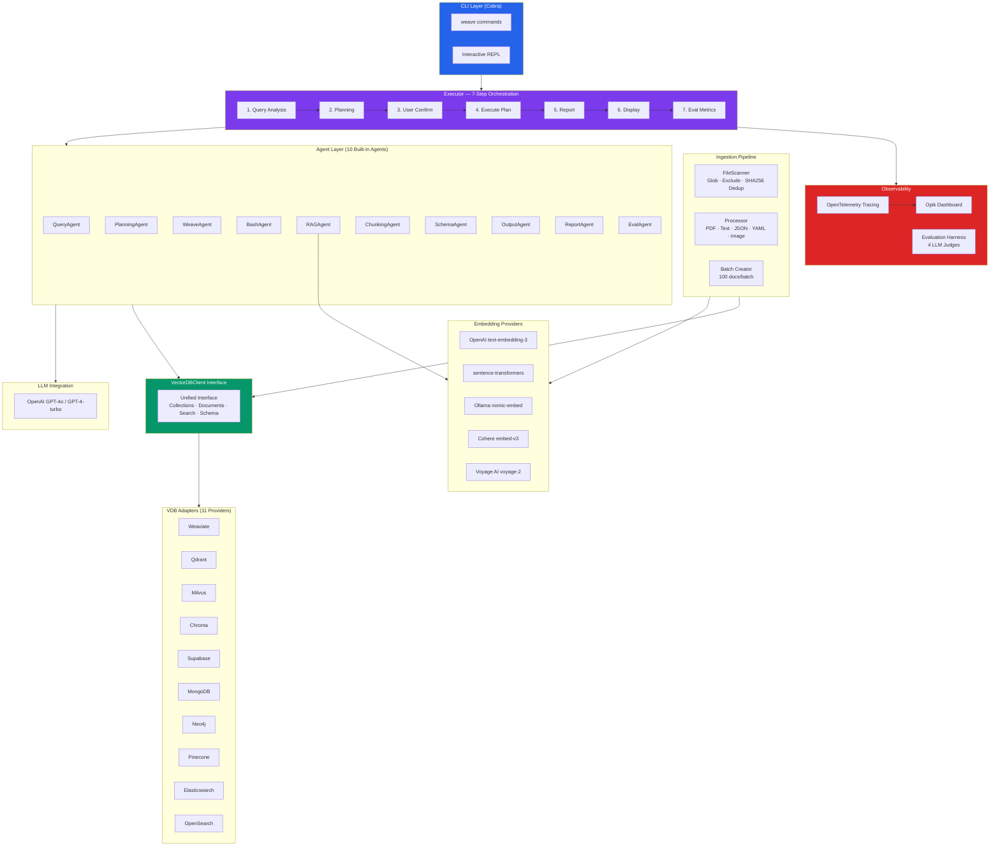
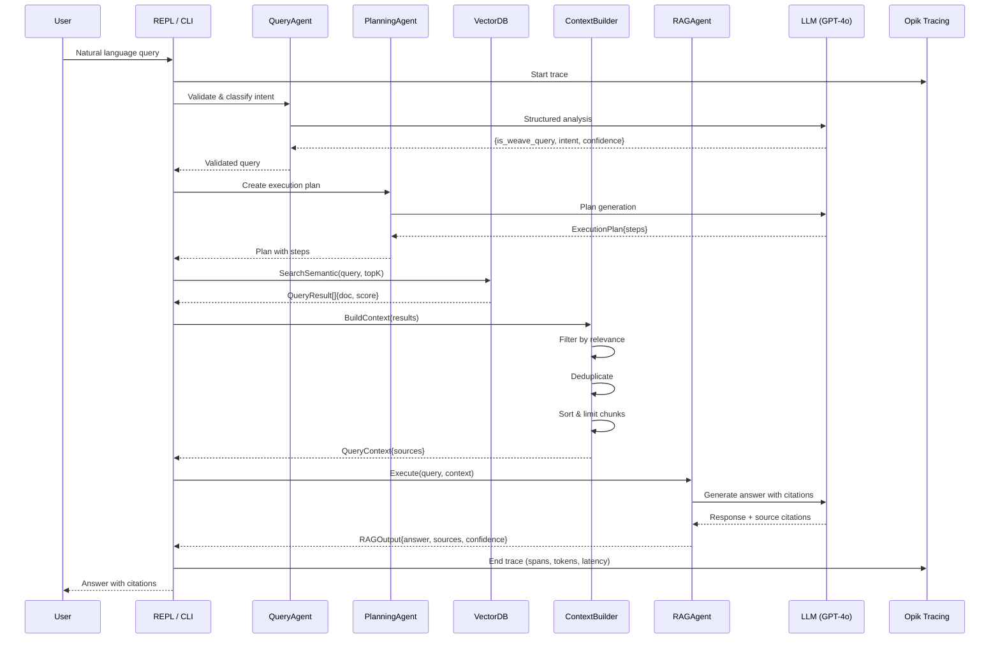

# Opik Video & Blog Collaboration — Checklist

**Contact:** Paul (Opik team)
**Ideal deadline:** 24 March 2026
**Hard deadline:** 31 March 2026

---

## 1. Big Picture Architecture

- [x] **System architecture diagram** — see Mermaid diagrams below
  - Full architecture doc: [`docs/ARCHITECTURE.md`](../ARCHITECTURE.md) (1,069 lines)
  - Screenshots: [`images/`](../../images/) (weave-cli_1.png, weave-cli_2.png, weave-cli_3.png)
  - [ ] _Max: review diagrams below, adjust for video/blog if needed_

### System Architecture (High-Level)

### Data Flow: RAG Query Execution

### Data Flow: Document Ingestion Pipeline

```mermaid
flowchart LR
    subgraph Input["Source Data"]
        PDF[PDFs]
        TXT[Text / Markdown]
        JSON[JSON / YAML]
        IMG[Images]
    end

    subgraph Scanner["FileScanner"]
        GLOB[Glob Matching]
        EXCL[Exclusion Filters]
        HASH[SHA256 Dedup]
    end

    subgraph Processor["Document Processor"]
        PDF_P[PDF Extractor<br/>Text + Images]
        TXT_P[Text Processor]
        JSON_P[JSON/YAML Parser]
        CHUNK[Chunking<br/>Agent-recommended]
    end

    subgraph Embed["Embedding Generation"]
        EMB[Embedding Provider<br/>OpenAI · ST · Ollama]
    end

    subgraph Batch["Batch Writer"]
        BW[200 docs/batch<br/>Checkpoint & Resume]
    end

    subgraph VDBs["Any VectorDB"]
        VDB[(Weaviate · Qdrant<br/>Milvus · Chroma<br/>+ 8 more)]
    end

    Input --> Scanner --> Processor --> Embed --> Batch --> VDBs

    style Input fill:#f59e0b,color:#000
    style Scanner fill:#3b82f6,color:#fff
    style Processor fill:#8b5cf6,color:#fff
    style Embed fill:#10b981,color:#fff
    style Batch fill:#ef4444,color:#fff
    style VDBs fill:#06b6d4,color:#fff
```

---

## 2. Go Deeper: Vector Database Layer & RAG Pipeline

### 2a. GitHub Links to Core Code

- [x] **VDB abstractions (unified provider interface)**
  - [`src/pkg/vectordb/interfaces.go`](../../src/pkg/vectordb/interfaces.go) — `VectorDBClient` interface (L82-97), `CollectionOperations` (L100-115), `DocumentOperations` (L118-142), `QueryOperations` (L145-157), `SchemaOperations` (L160-172)
  - [`src/pkg/vectordb/factory.go`](../../src/pkg/vectordb/factory.go) — `ClientFactory` interface, `Registry` pattern, 12+ `VectorDBType` constants (L15-37)
  - Adapters: `src/pkg/vectordb/{weaviate,qdrant,milvus,chroma,supabase,mongodb,neo4j,pinecone,elasticsearch,opensearch}/adapter.go`

- [x] **RAG ingestion logic**
  - [`src/pkg/pipeline/processor.go`](../../src/pkg/pipeline/processor.go) — `Processor.ProcessFiles()` (L36-161), PDF/text/JSON/YAML processing, batch creation
  - [`src/pkg/pipeline/scanner.go`](../../src/pkg/pipeline/scanner.go) — `FileScanner.Scan()` with glob/exclude, SHA256 dedup
  - [`src/pkg/pipeline/types.go`](../../src/pkg/pipeline/types.go) — `IngestOptions`, `IngestReport`
  - [`src/pkg/stack/ingest.go`](../../src/pkg/stack/ingest.go) — Stack ingestion with checkpoints, auto-restart, retry
  - [`src/pkg/embeddings/model_registry.go`](../../src/pkg/embeddings/model_registry.go) — Embedding model registry (OpenAI, Ollama, Cohere, Voyage, sentence-transformers)

- [x] **RAG retrieval logic**
  - [`src/pkg/agents/context_builder.go`](../../src/pkg/agents/context_builder.go) — `ContextBuilder.BuildContext()` — relevance filtering, dedup, sorting, max chunks
  - [`src/pkg/agents/rag_agent.go`](../../src/pkg/agents/rag_agent.go) — `RAGAgent.Execute()` — context assembly → LLM generation → citations
  - [`src/pkg/agents/query_agent.go`](../../src/pkg/agents/query_agent.go) — Query validation and intent classification
  - Search implementations: `src/pkg/vectordb/{chroma,weaviate,qdrant,...}/search.go` — `SearchSemantic()`, `SearchBM25()`, `SearchHybrid()`

### 2b. DEMO: Ingestion & Retrieval in 2 Databases

- [x] **Pick 2 databases** (suggested: Weaviate + Milvus, or Qdrant + Chroma)
- [ ] **Prepare multi-modal data** (PDF with images, text docs — good for visual demo)
- [ ] **Script the demo:**
  1. Show empty state of both databases
  2. Ingest documents into both (`weave pipeline ingest --collection ... --vdb-type ...`)
  3. Show populated state (document counts, schemas)
  4. Run semantic queries against both
  5. Run agent queries showing RAG in action
- [ ] **Record/screenshot the demo**
- _Owner: Max_

---

## 3. Go Deeper: Agents

### 3a. GitHub Links to Core Code

- [x] **Agent abstractions and implementation**
  - [`src/pkg/agents/agent.go`](../../src/pkg/agents/agent.go) — `Agent` interface: `Name()`, `Execute()` (L11-18)
  - [`src/pkg/agents/chain.go`](../../src/pkg/agents/chain.go) — `AgentChain` for sequential multi-agent execution (L13-140)

- [x] **REPL environment**
  - [`src/pkg/repl/repl.go`](../../src/pkg/repl/repl.go) — Interactive REPL with readline, batch mode, special commands (`/help`, `/search`, `/mcp`, `/collection`, `/stats`, etc.)

- [x] **Agent orchestration logic**
  - [`src/pkg/executor/executor.go`](../../src/pkg/executor/executor.go) — 7-step orchestration: Query → Plan → Confirm → Execute → Report → Display → Eval
  - Flow: `QueryAgent` → `PlanningAgent` → `executePlan()` (bash/weave steps) → `ReportAgent` → `EvalAgent`

- [x] **List of agents supported (10 built-in)**

  | Agent | File | Purpose |
  |-------|------|---------|
  | QueryAgent | `query_agent.go` | Query validation & intent classification |
  | PlanningAgent | `planning_agent.go` | Execution plan generation |
  | WeaveAgent | `weave_agent.go` | MCP tool execution with retry |
  | BashAgent | `bash_agent.go` | Safe bash command execution |
  | OutputAgent | `output_agent.go` | Formatted output & progress |
  | ReportAgent | `report_agent.go` | Operation report generation |
  | EvalAgent | `eval_agent.go` | Metrics tracking & evaluation |
  | RAGAgent | `rag_agent.go` | Retrieval-augmented generation |
  | ChunkingAgent | `chunking_agent.go` | Document chunking strategy |
  | SchemaAgent | `schema_agent.go` | Collection schema analysis |

  - **Custom agents** supported via YAML config: `src/pkg/agents/agent_registry.go`, `agent_loader.go`, `custom_agent_config.go`
  - Agent types: `rag`, `summarize`, `qa`, `custom`
  - CLI: `weave agents list|show|create|delete|edit|copy`

### 3b. DEMO: Agents in Action

- [ ] **Show agent orchestration** (query → plan → execute → report)
- [ ] **Show REPL environment** with interactive commands
- [ ] **Show custom agent creation** (YAML config → execution)
- [ ] **Use multi-modal data** if possible (image search, PDF RAG)
- _Owner: Max_

---

## 4. Opik: Monitoring

### 4a. GitHub Links to Core Code

- [x] **Opik monitoring integration**
  - [`src/pkg/llm/opik.go`](../../src/pkg/llm/opik.go) — `LoadOpikConfig()`, `InitOpikTracing()`, `ShutdownOpikTracing()`, `WrapHTTPClient()` — OpenTelemetry + OTLP exporter to Opik
  - [`src/pkg/executor/executor.go`](../../src/pkg/executor/executor.go) (L48-62) — Opik tracing init in executor

### 4b. DEMO: Opik Monitoring Dashboard

- [ ] **Run agents that generate traces with 5+ spans each** (the 7-step orchestration naturally produces this: query → plan → execute(bash/weave) → report → eval)
- [ ] **Walk through Opik dashboard showing:**
  - [ ] All spans from agents (LLM calls, tool calls) with input/output
  - [ ] Metadata attached to traces and spans
  - [ ] Costs, token usage, and latency breakdown
- [ ] **Explain what you monitor** from the whole application
- [ ] **Explain how Opik helped debug or optimize** (costs, latency, performance decisions)
- _Owner: Max_

---

## 5. Opik: Evaluation

### 5a. GitHub Links to Core Code

- [x] **Dataset upload to Opik**
  - Datasets: `evals/datasets/{baseline,technical-docs,medical-qa,simple-qa,custom-eval-demo}.yaml`

- [x] **Evaluation harness & Opik integration**
  - [`src/pkg/evaluation/provider.go`](../../src/pkg/evaluation/provider.go) — `EvaluatorProvider` interface (pluggable backends)
  - [`src/pkg/evaluation/provider_opik.go`](../../src/pkg/evaluation/provider_opik.go) — `OpikProvider` with 4 LLM judge evaluators:
    - `OpikAccuracyEvaluator` — semantic accuracy
    - `OpikFaithfulnessEvaluator` — groundedness
    - `OpikHallucinationEvaluator` — hallucination detection
    - `OpikContextRelevanceEvaluator` — context relevance
  - [`src/pkg/evaluation/provider_factory.go`](../../src/pkg/evaluation/provider_factory.go) — Factory for local vs Opik providers
  - [`src/pkg/evaluation/runner.go`](../../src/pkg/evaluation/runner.go) — `RunEvaluationWithProvider()`
  - [`src/cmd/eval/run.go`](../../src/cmd/eval/run.go) — CLI with `--use-opik` flag
  - [`src/pkg/evaluation/custom_evaluator.go`](../../src/pkg/evaluation/custom_evaluator.go) — Custom evaluator support

### 5b. DEMO 1: Single Experiment

- [ ] **Upload dataset to Opik** and show in dashboard (version, metadata, samples)
- [ ] **Run one experiment:** `weave eval run --agent rag-agent --dataset baseline --use-opik`
- [ ] **Walk through Opik dashboard:** metadata, results, metrics
- [ ] **Explain LLM judges chosen** (accuracy, faithfulness, hallucination, context relevance) and why
- [ ] **Answer:**
  - How Opik helped vs doing it all locally
  - Something surprising that evals revealed about RAG/agent quality
- _Owner: Max_

### 5c. DEMO 2: Multiple Experiments (Benchmarking)

- [ ] **Run experiments with different configs** (vary: VDB type, agent, retrieval params)
- [ ] **Compare results side-by-side in Opik dashboard**
- [ ] **Answer:**
  - What parameter change had bigger/smaller impact than expected?
  - What decision was made purely based on experiment data?
- _Owner: Max_

---

## 6. Other Relevant Links

- [ ] **Article on picking the right tech stack** (Go choice)
  - _Status: Max to provide link_
- [ ] **weave-cli breakdown article**
  - Draft: [`docs/BLOG_DRAFT.md`](../BLOG_DRAFT.md)
  - _Status: Updated with stack, evals, monitoring/Opik sections. Max to review and finalize._
- [ ] **Any other relevant links**
  - README: [`README.md`](../../README.md)
  - VDB Support Matrix: [`docs/VDB_SUPPORT_MATRIX.md`](../VDB_SUPPORT_MATRIX.md)
  - User Guide: [`docs/USER_GUIDE.md`](../USER_GUIDE.md)
  - Presentation: [`docs/PRESENTATION.md`](../PRESENTATION.md)

---

## 7. Final Questions (Written Answers)

### Q1: Looking back, what was the hardest thing to implement, and what surprised you the most while building weave-cli?

> _Draft — Max please review and personalize with your voice:_
>
> The hardest part was building the unified vector database abstraction layer. Each of the 12+ VDB providers has fundamentally different APIs, data models, and quirks — Weaviate uses GraphQL, Qdrant has gRPC and REST, Milvus requires explicit schema definitions, Chroma is schemaless, and so on. Designing a single `VectorDBClient` interface that felt natural for all of them, without leaking provider-specific concerns, took several iterations. The adapter pattern was the key insight — each VDB gets its own adapter that translates the unified interface into provider-native calls, plus a factory/registry for dynamic client creation.
>
> What surprised me the most was the embedding model story. We started with OpenAI embeddings as the default and assumed that was the gold standard. When we built the pluggable embedding provider system and benchmarked open-source models like sentence-transformers against OpenAI on our Client0 production dataset (426 auction documents), the OSS model scored 11% higher on quality, ran 240x faster for re-embedding, produced vectors that were 50% smaller, and cost nothing. That completely changed our perspective — we went from treating OSS embeddings as a "budget option" to recommending them as the default. The data from our evaluation harness and Opik dashboard is what made that decision clear; without structured evals, we would have kept assuming OpenAI was better.
>
> _Max: add anything about the agent orchestration challenges, the Kubernetes stack work, or Client0-specific surprises._

### Q2: If you had to rebuild weave-cli from scratch, at what point would you introduce monitoring and evaluation? Would you do it earlier, later, or the same?

> _Draft — Max please review and personalize:_
>
> I would introduce monitoring much earlier — ideally from the first week. When we started, we focused entirely on getting the VDB adapters and ingestion pipeline working, and monitoring came later as an "observability layer." In hindsight, having Opik tracing from day one would have saved us significant debugging time. For example, when we hit the silent document persistence failures with Milvus (Issue #57), we spent hours adding manual logging and retry logic. With OpenTelemetry traces flowing into Opik, we would have immediately seen the latency spikes and failed spans, and the root cause would have been obvious from the trace waterfall.
>
> Evaluation is different — I'd introduce it at the same point we did, which was after the core RAG pipeline was functional. You need a working system to evaluate. But I would design the evaluation harness interface earlier, even before implementing it. Knowing upfront that we'd need accuracy, faithfulness, hallucination, and context-relevance metrics would have influenced how we structured the RAG agent's output — adding citation tracking and confidence scores from the start rather than retrofitting them. The pluggable provider pattern (local evaluators vs Opik) was the right call, and having both options lets us run fast local evals during development while getting the full dashboard experience for benchmarking and reporting.
>
> _Max: add personal anecdotes — specific debugging sessions Opik helped with, or a decision the eval data drove._

> Opik was easy to integrate and was key to help get Client0 dashboard working since I could just run experiments and use evaluations and tracing to decide best options for Client0.

---

## Summary: What's Done vs What Needs Max

### Done
- [x] All GitHub links to core code (VDB abstractions, RAG, agents, Opik monitoring, Opik evaluation)
- [x] Architecture diagrams — 3 Mermaid diagrams (system, RAG flow, ingestion pipeline)
- [x] Agent list and orchestration documented (10 built-in + custom)
- [x] Evaluation datasets exist
- [x] Draft answers to Q1 and Q2

### Needs to be reviewed / completed
- [ ] Review Mermaid diagrams — adjust for video/blog
- [ ] Review & personalize Q1 and Q2 answers
- [ ] VDB + RAG demo (2 databases, multi-modal)
- [ ] Agents demo (orchestration, REPL, custom agents)
- [ ] **Opik monitoring demo** (dashboard walkthrough, 5+ span traces) — _highest priority per Paul_
- [ ] **Opik evaluation demo 1** (single experiment) — _highest priority per Paul_
- [ ] **Opik evaluation demo 2** (benchmarking, side-by-side) — _highest priority per Paul_
- [ ] Tech stack article link
- [ ] weave-cli breakdown article (finalize `docs/archive/BLOG_DRAFT.md`)
