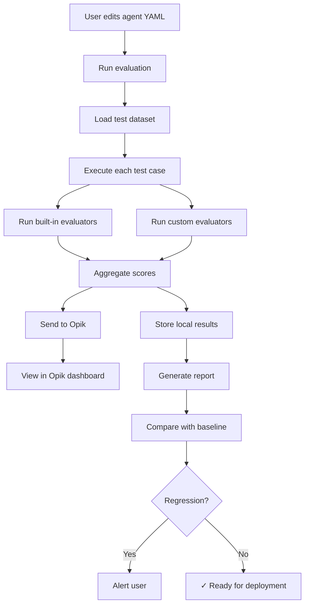

# Agent Evaluation System - Design Proposal

**Date:** 2026-01-22  
**Status:** Proposal  
**Priority:** High  
**Target Version:** v1.0

## Executive Summary

This proposal outlines a comprehensive agent evaluation system for Weave CLI that enables users to:
1. Evaluate the quality and accuracy of agent responses
2. Compare different agent configurations (prompts, models, parameters)
3. Track agent performance over time
4. Integrate with industry-standard evaluation frameworks (Opik, LangSmith, etc.)
5. Create custom evaluation metrics for domain-specific needs

## Problem Statement

### Current State
- Agents are configured via YAML files with various prompts, models, and parameters
- No systematic way to evaluate if agent responses are accurate or improving
- Users manually test agents by running queries and subjectively judging outputs
- No comparison mechanism between different agent configurations
- Limited visibility into agent performance metrics

### User Needs
- **Agent Tuning:** Users need to iterate on agent YAML configs (prompts, temperature, etc.) and know if changes improve or degrade performance
- **Quality Assurance:** Ensure agents provide accurate, relevant responses
- **Version Comparison:** Compare new agent versions against baselines
- **Production Monitoring:** Track agent performance in real-world usage
- **Custom Metrics:** Domain-specific evaluation criteria (e.g., medical accuracy, legal compliance)

## Proposed Solution

### Architecture Overview

```
┌─────────────────────────────────────────────────────────────┐
│                    Weave CLI Agent System                    │
├─────────────────────────────────────────────────────────────┤
│                                                               │
│  ┌──────────────┐      ┌──────────────┐      ┌───────────┐ │
│  │ Agent Config │─────▶│    Agent     │─────▶│  Response │ │
│  │  (YAML)      │      │   Executor   │      │           │ │
│  └──────────────┘      └──────────────┘      └─────┬─────┘ │
│                                                      │       │
└──────────────────────────────────────────────────────┼───────┘
                                                       │
                                                       ▼
┌─────────────────────────────────────────────────────────────┐
│                  Evaluation System (NEW)                     │
├─────────────────────────────────────────────────────────────┤
│                                                               │
│  ┌──────────────────────────────────────────────────────┐  │
│  │              Evaluation Dataset                        │  │
│  │  • Test queries + expected answers                     │  │
│  │  • Ground truth data                                   │  │
│  │  • User-provided examples                             │  │
│  │  • Synthetic test generation                          │  │
│  └──────────────────────────────────────────────────────┘  │
│                            │                                 │
│                            ▼                                 │
│  ┌──────────────────────────────────────────────────────┐  │
│  │           Evaluation Metrics Engine                   │  │
│  │  ┌────────────────┐  ┌────────────────┐             │  │
│  │  │  Built-in      │  │   Custom       │             │  │
│  │  │  Evaluators    │  │  Evaluators    │             │  │
│  │  │                │  │                │             │  │
│  │  │ • Accuracy     │  │ • User Python  │             │  │
│  │  │ • Hallucination│  │ • Domain-spec  │             │  │
│  │  │ • Relevance    │  │ • Business KPI │             │  │
│  │  │ • Citation     │  │                │             │  │
│  │  │ • Coherence    │  │                │             │  │
│  │  │ • Completeness │  │                │             │  │
│  │  └────────────────┘  └────────────────┘             │  │
│  └──────────────────────────────────────────────────────┘  │
│                            │                                 │
│                            ▼                                 │
│  ┌──────────────────────────────────────────────────────┐  │
│  │         External Integration Layer                    │  │
│  │  ┌──────────┐  ┌───────────┐  ┌──────────────┐     │  │
│  │  │  Opik    │  │LangSmith  │  │  Custom      │     │  │
│  │  │  (OpenTel│  │           │  │  Tracking    │     │  │
│  │  │  Traces) │  │           │  │              │     │  │
│  │  └──────────┘  └───────────┘  └──────────────┘     │  │
│  └──────────────────────────────────────────────────────┘  │
│                            │                                 │
│                            ▼                                 │
│  ┌──────────────────────────────────────────────────────┐  │
│  │         Results Storage & Comparison                  │  │
│  │  • Eval runs (timestamped)                           │  │
│  │  • Metric scores per agent version                   │  │
│  │  • Comparison reports                                │  │
│  │  • Regression detection                              │  │
│  └──────────────────────────────────────────────────────┘  │
└─────────────────────────────────────────────────────────────┘
```

### Components

#### 1. Evaluation Dataset Management

**Definition:** Collections of test cases for agent evaluation

```yaml
# evals/datasets/rag-agent-baseline.yaml
name: rag-agent-baseline-v1
description: Baseline test cases for RAG agent
version: "1.0.0"

test_cases:
  - id: tc-001
    query: "What is the capital of France?"
    expected_answer: "Paris"
    metadata:
      category: factual
      difficulty: easy
    
  - id: tc-002
    query: "Explain how photosynthesis works"
    expected_answer: |
      Photosynthesis is the process by which plants convert
      light energy into chemical energy...
    reference_sources:
      - source_id: biology-101
        expected_citation: true
    metadata:
      category: explanatory
      difficulty: medium
      requires_synthesis: true
    
  - id: tc-003
    query: "What are the main differences between RNA and DNA?"
    expected_answer: "DNA contains deoxyribose sugar while RNA contains ribose..."
    evaluation_criteria:
      - completeness: must mention 3+ key differences
      - citation_required: true
      - hallucination_check: strict
```

**Features:**
- YAML-based test case definitions
- Support for various answer types (factual, explanatory, comparative)
- Metadata for categorization and filtering
- Reference sources for citation validation
- Custom evaluation criteria per test case

#### 2. Built-in Evaluators

**a) Accuracy Evaluator**
```go
type AccuracyEvaluator struct {
    LLMClient llm.Client
}

// Evaluates semantic similarity between expected and actual answers
func (e *AccuracyEvaluator) Evaluate(ctx context.Context, testCase TestCase, response AgentResponse) (Score, error)
```

**Metrics:**
- Semantic similarity (0-1) using embeddings
- Exact match (boolean)
- Contains key facts (partial credit)

**b) Hallucination Evaluator**
```go
type HallucinationEvaluator struct {
    LLMClient llm.Client  // Uses LLM-as-judge
}

// Detects if response contains information not in source documents
func (e *HallucinationEvaluator) Evaluate(ctx context.Context, testCase TestCase, response AgentResponse) (Score, error)
```

**Detection methods:**
- Source attribution check
- Fact verification against sources
- LLM-as-judge for subtle hallucinations

**c) Citation Evaluator**
```go
type CitationEvaluator struct{}

// Validates citation format, completeness, and accuracy
func (e *CitationEvaluator) Evaluate(ctx context.Context, testCase TestCase, response AgentResponse) (Score, error)
```

**Checks:**
- All facts are cited
- Citations reference actual sources
- Citation format is correct
- No orphaned citations

**d) Relevance Evaluator**
```go
type RelevanceEvaluator struct {
    LLMClient llm.Client
}

// Measures if response addresses the query
func (e *RelevanceEvaluator) Evaluate(ctx context.Context, testCase TestCase, response AgentResponse) (Score, error)
```

**e) Coherence Evaluator**
```go
type CoherenceEvaluator struct {
    LLMClient llm.Client
}

// Evaluates response structure, flow, and readability
func (e *CoherenceEvaluator) Evaluate(ctx context.Context, testCase TestCase, response AgentResponse) (Score, error)
```

**f) Completeness Evaluator**
```go
type CompletenessEvaluator struct {
    LLMClient llm.Client
}

// Checks if response covers all aspects of the query
func (e *CompletenessEvaluator) Evaluate(ctx context.Context, testCase TestCase, response AgentResponse) (Score, error)
```

#### 3. Custom Evaluators

**Python-based Custom Evaluators:**
```yaml
# evals/evaluators/medical-accuracy.yaml
name: medical-accuracy
type: custom
language: python
script: evals/scripts/medical_accuracy.py

parameters:
  strict_mode: true
  approved_sources_only: true
  require_disclaimers: true
```

```python
# evals/scripts/medical_accuracy.py
def evaluate(test_case, response, context):
    """
    Custom medical accuracy evaluator
    
    Args:
        test_case: TestCase object with query and expected answer
        response: AgentResponse with actual answer
        context: Additional context (sources, metadata)
    
    Returns:
        EvalResult with score and explanation
    """
    score = 0.0
    issues = []
    
    # Check for medical disclaimers
    if not has_disclaimer(response.text):
        issues.append("Missing medical disclaimer")
        score -= 0.2
    
    # Verify against approved medical sources
    if not all_sources_approved(response.sources):
        issues.append("Uses non-approved sources")
        score -= 0.3
    
    # Check for outdated information
    if has_outdated_info(response.text, context):
        issues.append("Contains potentially outdated information")
        score -= 0.5
    
    return EvalResult(
        score=max(0.0, 1.0 + score),
        passed=len(issues) == 0,
        issues=issues,
        metadata={"evaluator": "medical-accuracy-v1"}
    )
```

#### 4. Opik Integration

**Leverage existing Opik integration:**

```go
// src/pkg/agents/eval_integration.go
type OpikEvaluator struct {
    tracerProvider *sdktrace.TracerProvider
    projectName    string
    workspace      string
}

func (e *OpikEvaluator) TraceEvaluation(ctx context.Context, evalRun EvalRun) error {
    // Create Opik trace for evaluation run
    tracer := otel.Tracer("weave-cli-eval")
    ctx, span := tracer.Start(ctx, "agent-evaluation")
    defer span.End()
    
    // Add evaluation metadata
    span.SetAttributes(
        attribute.String("agent.name", evalRun.AgentName),
        attribute.String("agent.version", evalRun.AgentVersion),
        attribute.String("dataset.name", evalRun.DatasetName),
        attribute.Int("test_cases.count", len(evalRun.TestCases)),
        attribute.Float64("overall.score", evalRun.OverallScore),
    )
    
    // Trace individual test case evaluations
    for _, tc := range evalRun.TestCases {
        e.traceTestCase(ctx, tc)
    }
    
    return nil
}

func (e *OpikEvaluator) traceTestCase(ctx context.Context, tc TestCaseResult) {
    tracer := otel.Tracer("weave-cli-eval")
    _, span := tracer.Start(ctx, "test-case")
    defer span.End()
    
    span.SetAttributes(
        attribute.String("test_case.id", tc.ID),
        attribute.String("query", tc.Query),
        attribute.Float64("accuracy.score", tc.Scores["accuracy"]),
        attribute.Float64("hallucination.score", tc.Scores["hallucination"]),
        attribute.Float64("relevance.score", tc.Scores["relevance"]),
        attribute.Bool("passed", tc.Passed),
    )
}
```

**Benefits:**
- Opik's LLM-as-judge evaluators
- Production trace monitoring
- Evaluation history and trends
- Comparison dashboards
- Cost tracking per evaluation

#### 5. CLI Commands

**New `weave eval` command:**

```bash
# Run evaluation on agent
weave eval run --agent rag-agent --dataset evals/datasets/baseline.yaml

# Run evaluation comparing two agents
weave eval compare \
  --agent-a configs/agents/rag-agent-v1.yaml \
  --agent-b configs/agents/rag-agent-v2.yaml \
  --dataset evals/datasets/baseline.yaml

# Show evaluation results
weave eval show --run-id eval-123456

# List all evaluation runs
weave eval list --agent rag-agent

# Generate evaluation report
weave eval report --run-id eval-123456 --format markdown > report.md

# Create new test dataset
weave eval dataset create --name medical-qa --interactive

# Validate agent against production data
weave eval validate --agent rag-agent --production-sample 100
```

**Example output:**
```
Evaluation Run: eval-20260122-143022
Agent: rag-agent-v2.yaml
Dataset: baseline-v1.yaml (25 test cases)
Duration: 2m 34s

Overall Metrics:
  ✓ Accuracy:       0.87  (target: 0.80)  ⬆ +0.12 vs v1
  ✓ Hallucination:  0.92  (target: 0.90)  ⬆ +0.08 vs v1
  ✓ Relevance:      0.89  (target: 0.85)  ⬆ +0.05 vs v1
  ✗ Citation:       0.73  (target: 0.80)  ⬇ -0.02 vs v1
  ✓ Coherence:      0.85  (target: 0.75)  ⬆ +0.10 vs v1
  ✓ Completeness:   0.81  (target: 0.80)  ⬆ +0.03 vs v1

Pass Rate: 88% (22/25 test cases)

Failed Test Cases:
  tc-007: Low citation score (0.40)
    Issue: Missing sources for 3 key facts
  tc-015: Hallucination detected (0.60)
    Issue: Added information not in sources
  tc-023: Low accuracy (0.55)
    Issue: Incomplete answer, missed 2 key points

Cost: $0.45 (LLM tokens)

Recommendation: ✓ Agent v2 shows improvement in 5/6 metrics
  Action: Review citation configuration before production deployment

View full report: weave eval show eval-20260122-143022
```

### Configuration

#### Agent YAML Extension

Add evaluation configuration to agent YAMLs:

```yaml
# configs/agents/rag-agent.yaml
name: rag-agent
version: "2.0.0"
# ... existing config ...

# NEW: Evaluation configuration
evaluation:
  enabled: true
  
  # Default evaluation metrics for this agent
  default_metrics:
    - accuracy
    - hallucination
    - relevance
    - citation
    - coherence
  
  # Thresholds for production deployment
  thresholds:
    accuracy: 0.80
    hallucination: 0.90
    relevance: 0.85
    citation: 0.80
    coherence: 0.75
  
  # Custom evaluators for this agent type
  custom_evaluators:
    - name: medical-accuracy
      enabled: true
      weight: 2.0  # Double weight for critical metrics
    
  # Opik integration
  opik:
    enabled: true
    track_all_queries: false  # Only track eval runs
    project_name: "weave-rag-agent"
  
  # Regression detection
  regression_detection:
    enabled: true
    baseline_version: "v1.8.0"
    alert_on_degradation: true
    degradation_threshold: 0.05  # Alert if any metric drops >5%
```

#### Evaluation Config

```yaml
# configs/evaluation.yaml
evaluation:
  # Global settings
  llm_as_judge:
    provider: openai
    model: gpt-4o
    temperature: 0.1
  
  # Dataset locations
  datasets_dir: evals/datasets
  
  # Results storage
  results_dir: evals/results
  retention_days: 90
  
  # Opik configuration
  opik:
    enabled: true
    endpoint: ${OTEL_EXPORTER_OTLP_ENDPOINT}
    api_key: ${OPIK_API_KEY}
    workspace: ${OPIK_WORKSPACE}
    default_project: weave-cli-evals
  
  # Performance
  parallel_evaluation: true
  max_concurrent_evaluators: 5
  timeout_per_test_case: 30s
  
  # Cost controls
  budget:
    max_cost_per_run: 5.00  # USD
    warn_above: 2.00
```

## Implementation Plan

### Phase 1: Foundation (Week 1-2)
**Goal:** Basic evaluation infrastructure

- [ ] Create evaluation data structures
  - TestCase, EvalRun, EvalResult types
  - Dataset YAML parser
  - Results storage schema

- [ ] Implement core evaluators
  - Accuracy evaluator (semantic similarity)
  - Basic hallucination detector
  - Citation validator

- [ ] Basic CLI commands
  - `weave eval run`
  - `weave eval show`
  - `weave eval list`

**Deliverable:** Can run basic evals on agents and view results

### Phase 2: Opik Integration (Week 3)
**Goal:** External tracking and monitoring

- [ ] Opik trace integration
  - Trace evaluation runs
  - Send metrics to Opik
  - Dashboard configuration

- [ ] Enhanced evaluators
  - LLM-as-judge implementation
  - Relevance evaluator
  - Coherence evaluator

- [ ] Comparison functionality
  - `weave eval compare` command
  - Delta calculations
  - Regression detection

**Deliverable:** Full Opik integration with comparison features

### Phase 3: Custom Evaluators (Week 4)
**Goal:** User extensibility

- [ ] Custom evaluator framework
  - Python script execution
  - Evaluator plugin system
  - Parameter passing

- [ ] Dataset management
  - Dataset creation wizard
  - Import/export formats
  - Version control integration

- [ ] Reporting
  - Markdown reports
  - HTML dashboards
  - CI/CD integration

**Deliverable:** Users can create custom evaluators and generate reports

### Phase 4: Production Features (Week 5-6)
**Goal:** Production-ready evaluation

- [ ] Production sampling
  - Random production trace sampling
  - Continuous evaluation
  - Anomaly detection

- [ ] Advanced features
  - A/B testing framework
  - Automatic prompt optimization
  - Cost-quality tradeoff analysis

- [ ] Documentation & Examples
  - User guide
  - Example evaluators
  - Best practices

**Deliverable:** Production-ready evaluation system

## Success Metrics

### User Success
- Users can quantitatively compare agent versions
- Evaluation runs complete in <5 minutes for 100 test cases
- Users create and deploy custom evaluators
- Regression detection prevents quality degradation

### System Success
- >90% test case evaluation success rate
- <$1 average cost per evaluation run
- <10s latency per test case evaluation
- Integration with Opik for all traces

### Business Success
- Faster agent iteration cycles
- Reduced manual testing effort
- Higher agent quality in production
- Better visibility into agent performance

## Risk Mitigation

### Technical Risks

**Risk:** LLM-as-judge evaluations are slow and expensive
- **Mitigation:** Implement caching, parallel execution, cost budgets
- **Mitigation:** Provide cheaper heuristic evaluators as alternatives
- **Mitigation:** Sample-based evaluation for large datasets

**Risk:** Custom evaluators create security vulnerabilities
- **Mitigation:** Sandbox Python execution
- **Mitigation:** Code review for built-in evaluators
- **Mitigation:** Restrict file system access

**Risk:** Opik integration failures
- **Mitigation:** Graceful degradation when Opik unavailable
- **Mitigation:** Local-only evaluation mode
- **Mitigation:** Retry logic and error handling

### User Experience Risks

**Risk:** Complex configuration overwhelms users
- **Mitigation:** Sensible defaults for all agents
- **Mitigation:** Wizard for dataset creation
- **Mitigation:** Example evaluators and datasets

**Risk:** Evaluation results are hard to interpret
- **Mitigation:** Clear, actionable reports
- **Mitigation:** Visual comparisons
- **Mitigation:** Specific recommendations

## Future Enhancements

### V2 Features
- Automatic test case generation from production logs
- Multi-agent evaluation scenarios
- Evaluation-driven prompt optimization
- Integration with other platforms (LangSmith, Weights & Biases)
- Continuous evaluation pipelines
- Evaluation metric leaderboards

### Research Directions
- Adversarial testing for robustness
- Bias detection in agent responses
- Cross-lingual evaluation
- Multi-modal evaluation (text + images)

## Open Questions

1. **Dataset Management:** Should we provide pre-built evaluation datasets for common domains?
2. **Cost Optimization:** What's the right balance between evaluation quality and cost?
3. **Real-time vs Batch:** Should we support real-time evaluation during queries?
4. **Metrics Standardization:** Should we align with emerging industry standards (e.g., HELM, BIG-Bench)?

## Appendix

### Example Evaluation Flow



### Related Work

- **OpenAI Evals:** https://github.com/openai/evals
- **LangChain Evaluators:** https://python.langchain.com/docs/guides/evaluation
- **HELM Benchmark:** https://crfm.stanford.edu/helm/
- **Opik Documentation:** https://www.comet.com/docs/opik/

### References

- [Opik GitHub](https://github.com/comet-ml/opik)
- [LLM-as-judge Best Practices](https://www.comet.com/site/products/opik/)
- [RAG Evaluation Patterns](https://www.comet.com/docs/opik/cookbook/rag)
